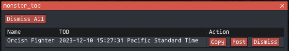

# todbot
An Ashita4 plugin for automatically posting the TOD of NMs to a Discord Webhook with Discord compatible timestamps.

## Setup
Settings located in `config\addons\todbot\<Username_####>\settings.lua`.

Running `/addon load todbot` once will generate this file.

You may also configure it with `/todbot config`

Use `/todbot debug` to always prompt to post for every monster regardless of NM match.

The NM list is located in [nm_list.lua](nm_list.lua) and can be edited to suit your needs.

## Usage
When an NM disappears a menu will pop up showing the monster name, TOD, and buttons to `Post` or `Dismiss` this TOD. Clicking `Post` will post the TOD to Discord with discord compatible timestamps.

To toggle Horizon NM usage (They Era+ the mob windows) use `/todbot horizon` or add to startup script

## Bugs
- An event is triggered when morning despawns night mobs
- An event is triggered when avatars are despawned
- For more, see `TODO`s in [todbot.lua](todbot.lua)