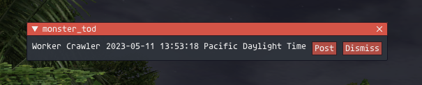

# todbot
An Ashita4 plugin for automatically posting the TOD of monsters to a Discord Webhook with Discord compatible timestamps.

## Setup
Settings located in `config\addons\todbot\<Username_####>\settings.lua`.
You can `/addon load todbot` once to generate this file.
You may also configure it with `/todbot config`

## Usage
When a monster disappears a menu will pop up showing the monster name, TOD, and buttons to `Post` or `Dismiss` this TOD. Clicking `Post` will post the TOD to Discord with discord compatible timestamps.

Currently all monsters that die generate a pop up. In the future it will only generate a popup for NMs or user configure monsters.

## Bugs
- An event is triggered when morning despawns night mobs
- An event is triggered when avatars are despawned
- For more, see `TODO`s in [todbot.lua](todbot.lua)